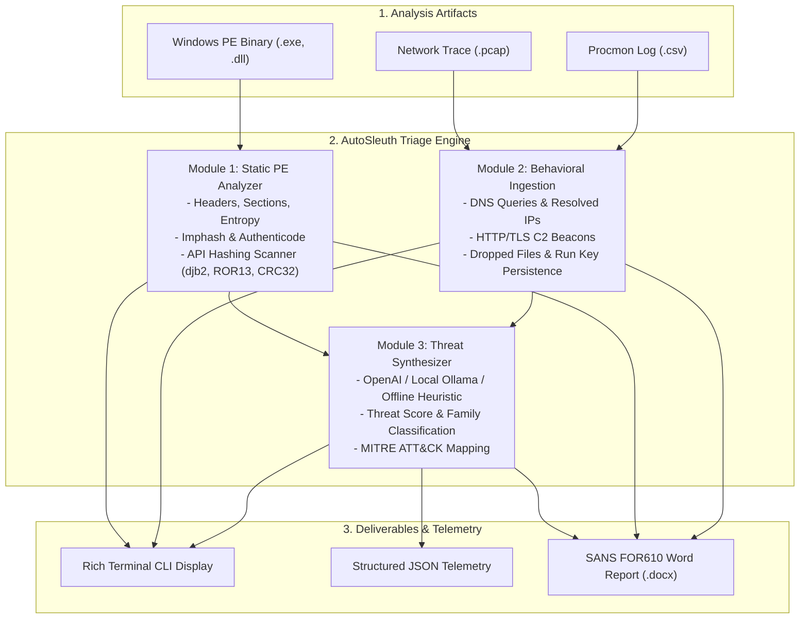

# ⚡ AutoSleuth-Triage: AI-Assisted Malware Triage & SANS FOR610 Report Engine

[](https://www.python.org/downloads/)
[](https://opensource.org/licenses/MIT)
[](https://www.sans.org/cyber-security-courses/reverse-engineering-malware-malware-analysis-tools-techniques/)
[](https://attack.mitre.org/)

An automated, modular, CLI-driven malware triage framework designed for **Malware Analysts**, **Reverse Engineers**, and **Incident Responders**. 

`AutoSleuth-Triage` inspects suspicious Windows PE binaries, ingests dynamic behavioral telemetry (PCAP network traces, Process Monitor CSV logs, and Regshot diffs), synthesizes threat intelligence using state-of-the-art LLMs (OpenAI, Ollama, or an offline heuristic engine), and automatically compiles a completed assessment report into the industry-standard **SANS FOR610 (GREM) DOCX template**.

---

## 🏗️ Architecture & Pipeline



---

## 🚀 Key Features

### 1. Advanced Static PE Inspection (`analyzer/static.py`)
- **Headers & Timestamps:** Parses DOS, File, and Optional Headers; extracts Machine Architecture, Subsystem, ImageBase, EntryPoint, and flags anomalous timestamps (e.g. Timestomping).
- **Section Entropy & RWX Detection:** Calculates per-section Shannon entropy and overall file entropy. Automatically flags dangerous memory permissions (`RWX` - Read-Write-Execute) typical of packers and shellcode loaders.
- **API Hashing Detection (Maldev Academy Integration):** Automatically scans binary bytes for precomputed hash constants used by malware to conceal the Import Address Table (`djb2`, `ROR13`, `CRC32`, `FNV-1a`, `MurmurHash3`).
- **Targeted String Extraction:** Heuristically extracts and deduplicates ASCII and UTF-16 strings, categorizing IPv4 addresses, URLs, Registry paths, and suspicious command-line executions (`powershell`, `bitsadmin`, `certutil`).

### 2. Behavioral Artifact Ingestion (`analyzer/behavioral.py`)
- **Network PCAP Parsing (Scapy):** Extracts DNS lookups, resolved IP addresses, HTTP requests (Method, Host, URI, User-Agent), TLS SNI domains, and identifies persistent C2 beaconing patterns.
- **Process Monitor (Procmon) Parsing:** Filters thousands of events down to high-value actionable indicators:
  - Files dropped into `AppData`, `Temp`, or `Startup`.
  - Registry persistence modifications (`HKCU\...\CurrentVersion\Run`, `RunOnce`, Services).
  - Child process spawning (`cmd.exe`, `powershell.exe`, `rundll32.exe`).
- **Regshot Integration:** Ingests registry comparison diffs.

### 3. Dual-Engine Threat Synthesizer (`ai/agent.py`)
- **LLM Mode (OpenAI / Ollama):** Formulates contextualized threat narratives, assesses threat scores (0-100), and classifies malware families.
- **Offline Expert Heuristic Engine:** Operates seamlessly without internet or API keys in air-gapped malware analysis sandbox environments, computing deterministic threat scores and mapping observations directly to **MITRE ATT&CK techniques**.

### 4. Automated SANS FOR610 Report Generation (`reporter/docx_generator.py`)
- Directly targets and fills all 58 rows of the official SANS FOR610 `Malware_Analysis_Report_Template.docx`, preserving font styles, cell borders, and layout integrity:
  1. `BACKGROUND`: Dates, hashes, notification vectors, file metadata.
  2. `STATIC ANALYSIS`: Section tables, entropy graphs, imphash, authenticode, strings, API hashing.
  3. `BEHAVIORAL ANALYSIS`: Dropped files, registry autostarts, DNS/HTTP network artifacts.
  4. `CODE ANALYSIS`: Entry point analysis, disassembly highlights, API hashing lookups, OEP debugging notes.
  5. `ANALYSIS SUMMARY`: Host & Network IOCs, Key Functionality, Purpose, Persistence, Impact, MITRE ATT&CK, and Incident Response Recommendations.

---

## 📦 Installation

```bash
# Clone repository
git clone https://github.com/your-username/AutoSleuth-Triage.git
cd AutoSleuth-Triage

# Install dependencies
pip install -r requirements.txt
```

---

## 💻 Usage

### Basic CLI Usage

```bash
python3 main.py \
  --sample /path/to/sample.exe \
  --pcap /path/to/traffic.pcap \
  --procmon /path/to/procmon.csv \
  --output Investigation_Report.docx \
  --json-output telemetry.json
```

### Command Line Options

| Argument | Flag | Description |
| :--- | :--- | :--- |
| `--sample` | `-s` | Path to suspicious Windows PE file (`.exe`, `.dll`, `.sys`) |
| `--pcap` | `-p` | Path to network capture trace file (`.pcap`) |
| `--procmon` | `-m` | Path to Process Monitor event log (`.csv`) |
| `--regshot` | `-r` | Path to Regshot diff file (`.txt`) |
| `--output` | `-o` | Destination path for the SANS FOR610 DOCX report |
| `--json-output`| `-j` | Optional path to export raw structured JSON telemetry |
| `--llm-provider`| | Choice of provider: `auto`, `openai`, `ollama`, or `heuristic` (default: `auto`) |
| `--api-key` | | OpenAI API Key (or set `OPENAI_API_KEY` environment variable) |
| `--api-base`| | Base URL for OpenAI-compatible endpoint (e.g. `http://localhost:11434/v1`) |
| `--model` | | Model identifier (default: `gpt-4o` or `llama3.2`) |

---

## 🧪 Testing & Verification

Run the built-in test generator and verification suite:

```bash
# 1. Generate benign verification PE binary, simulated PCAP, and Procmon CSV
python3 tests/generate_test_artifacts.py

# 2. Run automated test suite
python3 -m unittest discover -s tests -p "test_pipeline.py"

# 3. Execute end-to-end triage demo
python3 main.py \
  --sample tests/sample_benign_triage.exe \
  --pcap tests/sample_traffic.pcap \
  --procmon tests/sample_procmon.csv \
  --output tests/Generated_Triage_Report.docx
```

---

## 🛡️ Alignment with SANS FOR610 & MITRE ATT&CK

| Phase | Methodology / Technique |
| :--- | :--- |
| **Initial Assessment** | File Hashing (MD5, SHA1, SHA256), Imphash, Authenticode Signature Verification |
| **Static Inspection** | Section Entropy Calculation, RWX Permissions, API Hashing Scanning (`T1027.007`) |
| **Behavioral Ingestion** | Registry Run Key Persistence (`T1547.001`), Dropped Files (`T1105`), DNS/HTTP Beacons (`T1071`) |
| **Threat Contextualization**| MITRE ATT&CK Matrix Mapping, IOC Aggregation, Threat Scoring |
| **Executive Reporting** | Standardized SANS FOR610 Word Document Output |

---

## 📄 License
This project is licensed under the MIT License - see the [LICENSE](LICENSE) file for details.
