# 0206: Independent, Local-First Malware Analysis & Reporting Platform

[](https://www.python.org/downloads/)
[](https://opensource.org/licenses/MIT)
[](https://attack.mitre.org/)
[]()

> **"0206 is an independent, local-first, evidence-driven malware analysis and reporting platform that progresses from basic static/behavioral analysis to advanced static/dynamic analysis and produces a structured, evidence-grounded malware-analysis report."**

---

### In 30 Seconds: What You Need to Know

- **WHAT IS 0206?** An evidence-driven platform that triages suspicious PE binaries and behavioral telemetry, correlates static and dynamic indicators, preserves analytical uncertainty, and compiles comprehensive reports.
- **WHY DOES IT EXIST?** Malware analysis workflows often suffer from disconnected tools, hallucinated AI summaries, ungrounded heuristics, and messy reporting. 0206 provides a rigorous pipeline connecting raw observations to verified findings.
- **WHAT DOES IT PRODUCE?** Standalone forensic case bundles containing **Machine JSON**, **Executive Markdown**, professional **DOCX reports** (generic or template-adapted), structured **Evidence Stores**, **Finding Catalogs**, **IOCs**, **Coverage Matrices**, and **Cryptographic Audit Manifests**.
- **WHAT DO I NEED TO RUN IT?** A clean machine with Python 3.10+ and standard open-source packages (`pefile`, `capstone`, `scapy`, `python-docx`, `pydantic`, `rich`). **No IDA Pro, Ghidra, x64dbg, WinDbg, PEView, cloud APIs, MCP servers, or proprietary course materials required.**

> [!IMPORTANT]
> **What 0206 IS NOT:**
> - **NOT an IDA Pro or Ghidra replacement:** 0206 performs static code triage and normalizes external disassembly/decompilation evidence into domain-based records.
> - **NOT a universal automated sandbox:** 0206 safely ingests recorded execution traces (PCAP, Procmon CSV, Regshot); it will **NEVER** execute live hostile malware directly on your analyst workstation.
> - **NOT an automated malware oracle:** It distinguishes potential capability from confirmed runtime behavior.
> - **NOT an official SANS Institute product:** It provides independent forensic schemas inspired by common industry malware-analysis report structures without distributing copyrighted courseware.

---

## ⚡ Quickstart

```bash
# 1. Clone repository
git clone https://github.com/DangGPhuc/0206.git
cd 0206

# 2. Set up virtual environment and install in editable mode
python3 -m venv .venv
source .venv/bin/activate
pip install -e .

# 3. Verify environment health & platform diagnostics
0206 doctor

# 4. Run automated offline self-test
0206 selftest

# 5. Analyze sample in offline mode
0206 analyze sample.exe --offline
```

---

## 📊 Capability & Implementation Status Matrix

Every capability in 0206 is explicitly classified by its actual implementation status:

| Capability / Module | Status | Technical Description |
| :--- | :---: | :--- |
| **PE Static Triage** | `IMPLEMENTED` | Headers, section entropy, imports, exports, API hashing constants (djb2, ror13, crc32, fnv1a) |
| **Static Code Triage (Capstone)** | `IMPLEMENTED` | Entry point disassembly and instruction decoding |
| **Reputation Stage (VirusTotal)** | `IMPLEMENTED` | Pluggable hash-only lookup; never uploads samples; offline-safe fallback |
| **Behavioral Telemetry Ingestion** | `IMPLEMENTED` | Normalizes Procmon CSV, Regshot diffs, and streaming PCAP traces |
| **Evidence Store & Provenance** | `IMPLEMENTED` | Deterministic fingerprinting, atomic deduplication, lineage tracking |
| **Correlation Engine** | `IMPLEMENTED` | Multi-evidence correlation rules for process injection, C2, and persistence |
| **Deterministic Assessment** | `IMPLEMENTED` | Authoritative scoring, classification, and calibrated MITRE ATT&CK mapping |
| **Privacy & Secret Redaction (DLP)** | `IMPLEMENTED` | Best-effort privacy redaction + fail-closed transmission gate for detected sensitive fields |
| **Deterministic Offline AI** | `IMPLEMENTED` | Rule-based narrative synthesizer; zero network calls; zero API keys required |
| **Canonical Two-Stage Reporting** | `IMPLEMENTED` | 25-section Markdown, DOCX, and Machine JSON reports with explicit `[NOT_ANALYZED]` tags |
| **Output Artifact Lineage** | `IMPLEMENTED` | Detached `analysis_manifest.sha256` and cryptographic hash verification |
| **Bounded External Tool Execution** | `IMPLEMENTED` | Subprocess isolation (shell=False), argument arrays, process-tree timeout termination, and bounded temporary-file I/O |
| **OS-level Static Tool Sandbox** | `NOT_IMPLEMENTED` | Static analyzers execute under host process boundaries without containerization or kernel sandboxing |
| **Remote AI (OpenAI / Anthropic)** | `OPTIONAL` | Gated by pre-flight DLP audit; allowlist projected envelope; non-authoritative interpretation layer only |
| **Local LLM (Ollama)** | `OPTIONAL` | Local service integration with Ollama daemon; isolated credentials |
| **Template-Adapted DOCX** | `OPTIONAL` | Report adapter inspired by common industry malware-analysis report structures |
| **YARA Scanner Adapter** | `PARTIAL` | Active only when yara engine is installed AND valid ruleset is provided; otherwise reported as `[NOT_ANALYZED]` |
| **Ghidra Adapter** | `PARTIAL` | Capability detection and optional headless script invocation if installed |
| **Capa / Radare2 / FLOSS** | `PARTIAL` | External tool wrapper invoking local CLI if detected in PATH |
| **IDA Pro Adapter** | `STUB` | Normalization contract ready; requires user-provided IDA Pro license |
| **Live Detonation Sandbox (VirtualBox)** | `FUNCTIONAL` | Fail-closed Windows VM orchestration via VBoxManage, default-deny network verification, in-guest Procmon/PCAP/Regshot telemetry, and baseline snapshot restoration |
| **Live Detonation Sandbox (QEMU / VMware / External)** | `SCAFFOLD` | Standardized interface and schemas defined; hypervisor automation is scaffolded |

---

## 🏛️ Critical Design Principle

0206 strictly enforces non-collapsing separation across every stage of analysis:

$$\text{OBSERVATION} \longrightarrow \text{EVIDENCE} \longrightarrow \text{FINDING} \longrightarrow \text{CORRELATION} \longrightarrow \text{ASSESSMENT} \longrightarrow \text{REPORT}$$

| Stage | Example | Meaning |
| :--- | :--- | :--- |
| **Observation** | `VirtualAllocEx` imported in Import Table | Raw fact extracted from binary headers |
| **Evidence** | `E-0012` (`state=OBSERVED`, `confidence=1.0`) | Canonical, fingerprinted forensic evidence record |
| **Finding** | `F-0004` ("Suspicious Memory Allocation Capability") | Inferred capability based on static indicators |
| **Correlation** | `VirtualAllocEx` + `WriteProcessMemory` + Procmon remote thread creation | Correlating static capability with observed behavioral telemetry |
| **Assessment** | "Remote Process Injection Confirmed" (`Score: 78/100`) | Multi-domain risk evaluation and threat rating |
| **Report** | Two-stage technical report with full provenance citations | Human-readable explanation grounded in verifiable evidence IDs |

*Rule: Never treat a single capability heuristic as confirmed hostile behavior.*

---

## 📐 System Architecture

```mermaid
flowchart TD
    subgraph Inputs["1. Analysis Inputs"]
        PE["Target PE Binary (.exe, .dll)"]
        PCAP["Network Trace (.pcap)"]
        PROCMON["Procmon CSV Log (.csv)"]
        REGSHOT["Regshot Diff (.txt)"]
    end

    subgraph SecurityPolicy["2. Safety & Policy Layer"]
        RP["Resource Policy Guard (Size, Packet, Row Limits)"]
        MAN["AnalysisManifest (Pre-Analysis Streaming Hashes)"]
        REP["Reputation Engine (Hash Lookup Only - Zero Binary Upload)"]
    end

    subgraph Analyzers["3. Analysis Engines"]
        PEA["PEStaticAnalyzer (Headers, Sections, Entropy, Imports, Exports, Hashing)"]
        DIS["CodeAnalyzer (Capstone Static Code Triage & Control Flow Hints)"]
        BEH["BehavioralAnalyzer (PCAP Streaming, Beaconing Scores, Host Events)"]
        OPT["Optional Integrations (YARA, capa, Ghidra, radare2, pe-sieve)"]
    end

    subgraph EvidenceStore["4. Evidence Store & Graph"]
        ES["EvidenceStore (Atomic Deduplication, Fingerprinting, Parent-Child Lineage)"]
    end

    subgraph CorrelationEngine["5. Correlation & Findings"]
        CR["CorrelationEngine (Capability vs Observed vs Confirmed Behavior)"]
        FE["FindingEngine (Domain Weighting, Decay, & Explainable Scoring)"]
    end

    subgraph PrivacyAI["6. Privacy Boundary & Grounded AI"]
        DLP["PrivacyRedactor & DLP Filter (Scrub Usernames, Paths, Secrets)"]
        AI["Grounded AI Synthesizer (Offline Fallback | OpenAI | Anthropic | Ollama)"]
        VAL["GroundingValidator (Reject Hallucinated IOCs / Unknown Evidence IDs)"]
    end

    subgraph Deliverables["7. Case Deliverables & Lineage"]
        REP_JSON["report.json"]
        REP_MD["report.md"]
        REP_DOCX["report.docx (Generic / SANS-Style)"]
        MANIFEST["analysis_manifest.json + .sha256"]
        EV_JSON["evidence.json / findings.json / assessment.json / iocs.json / coverage.json"]
    end

    Inputs --> SecurityPolicy
    SecurityPolicy --> Analyzers
    Analyzers --> EvidenceStore
    EvidenceStore --> CorrelationEngine
    CorrelationEngine --> PrivacyAI
    PrivacyAI --> Deliverables
```



---

## 🔬 Canonical 23-Section Report Structure

Every report generated by 0206 adheres to the canonical 23-section structure:

### PART I — BASIC ANALYSIS
1. **Sample Identification:** File metadata, SHA256/SHA1/MD5, file size, PE architecture, subsystem, entry point RVA, image base.
2. **Reputation:** Hash reputation lookup (VirusTotal / providers). Defaults to hash lookup only; **never uploads binaries**.
3. **Basic Static Analysis:** PE sections, Shannon entropy, imports, exports, suspicious strings, URLs, IPs, API hashing constants.
4. **Basic Behavioral Analysis:** Ingestion and normalization of Procmon, Regshot, and telemetry logs into unified event primitives (`PROCESS_CREATE`, `FILE_WRITE`, `REGISTRY_WRITE`).
5. **Initial Findings:** Grounded inferences categorized by domain and confidence.
6. **Initial Assessment:** Deterministic risk score and initial threat classification.

### PART II — ADVANCED ANALYSIS
7. **Advanced Static Analysis:** Loader validation, section anomalies, embedded payloads.
8. **Assembly / Code Analysis:** Entry-point disassembly via Capstone, instruction decoding, suspicious patterns.
9. **API / Control Flow Analysis:** Dynamic resolution tracking, API hashing constants, xrefs.
10. **Advanced Dynamic Analysis:** Process tree hierarchies, execution traces, sandbox telemetry.
11. **Process / Thread Analysis:** Process relationships, thread injection tracing.
12. **Memory Analysis:** RWX section identification, shellcode buffers, in-memory patch detection.
13. **Network / C2 Analysis:** Streaming PCAP processing, DNS query extraction, HTTP requests, beaconing periodicity, and jitter metrics.
14. **Persistence:** Autostart registry keys, scheduled tasks, service registrations.
15. **Anti-Analysis:** Anti-debugging, timing anomalies, virtualization checks.
16. **Unpacking:** Section entropy deltas, packed headers.
17. **Cross-Stage Correlation:** Correlating static capabilities with dynamic execution traces to promote capabilities to `CONFIRMED_BEHAVIOR`.
18. **Final Assessment:** Authoritative threat score, threat level, classification, and executive synthesis.

### APPENDICES & AUDIT
19. **Indicators of Compromise (IOC):** Host and network IOCs.
20. **MITRE ATT&CK:** Calibrated technique mapping with confidence, basis, and citing evidence IDs.
21. **Limitations:** Analysis boundaries, non-destructive static rules, offline parameters.
22. **Evidence Appendix:** Complete catalog of all verified EvidenceRecords and parent lineage.
23. **Analysis Manifest:** Execution environment, Python version, host platform, tool versions, resource limits, and Analysis Coverage Matrix.

*Note: Any domain for which evidence was not provided explicitly outputs `[NOT_ANALYZED]`. 0206 never fabricates data for missing sections.*

---

## 🔒 Privacy & DLP Security Guard

0206 incorporates a strict best-effort **Data Loss Prevention (DLP)** boundary:

$$\text{RAW DATA} \longrightarrow \text{NORMALIZED DATA} \longrightarrow \text{DLP / PRIVACY REDACTION} \longrightarrow \text{REMOTE AI}$$

- **Strict Mode (Default):** Sanitizes absolute filesystem paths, Windows usernames (`C:\Users\<USER>`), Linux users (`/home/<USER>`), hostnames, IP subnets, API keys, credentials, and private tokens before generating reports or sending data to an optional LLM.
- **DLP Transmission Gate:** If sensitive unredacted credentials or keys are detected in the payload destined for remote transmission, 0206 triggers `BLOCK_REMOTE_TRANSMISSION` and automatically falls back to offline deterministic evaluation.
- **Offline Semantics (`--offline`):** Disables all remote AI requests, reputation lookups, and external enrichment APIs. (Note: Does not claim OS-level network isolation unless run inside a network-isolated container or VM).
- **Default Privacy-Safe Exports:** Standard output files (`evidence.json`, `findings.json`, `report.*`) are sanitized by default. Raw unredacted internal evidence is only exported when explicitly requested via `--export-raw-evidence` to `evidence.raw.json`.

---

## 🤖 Non-Authoritative AI Architecture

AI in 0206 serves strictly as an **interpretation layer**, never as an evidence authority:

- **What AI CAN do:** Contextualize narrative summaries, explain relationships between findings, propose investigative hypotheses, and prioritize next reverse engineering steps.
- **What AI CANNOT do:**
  - Cannot override the deterministic threat score or threat level.
  - Cannot invent file hashes, IP addresses, domains, or registry keys.
  - Cannot claim a behavior exists without citing a verified `Evidence ID` (e.g. `E-0014`).
  - Unsupported claims are automatically **REJECTED** or **DOWNGRADED** by the `GroundingValidator`.

Supported AI Providers:
- **Offline (Default):** Deterministic, rule-based narrative synthesizer. Zero network calls, zero API keys required.
- **OpenAI:** GPT-4o / GPT-4o-mini via API key.
- **Anthropic:** Claude 3.5 Sonnet via API key.
- **Ollama:** Local open models (`llama3`, `mistral`) via local HTTP endpoints.

---

## 💻 CLI Reference

```bash
# General Syntax
0206 <subcommand> [options]

# 1. Analyze a malware sample (interactive mode)
0206 analyze sample.exe

# 2. Analyze with behavioral telemetry artifacts
0206 analyze sample.exe --pcap network.pcap --procmon procmon.csv --regshot regshot.txt

# 3. Enforce 100% offline analysis (no remote AI, no external APIs)
0206 analyze sample.exe --offline

# 4. Export unredacted raw internal evidence (opt-in)
0206 analyze sample.exe --offline --export-raw-evidence

# 5. Machine-readable JSON output to stdout
0206 analyze sample.exe --offline --json

# 6. Quiet mode (minimal logs)
0206 analyze sample.exe --offline --quiet

# 7. Disable ANSI color codes
0206 analyze sample.exe --offline --no-color

# 8. Run system doctor and tool diagnostics
0206 doctor

# 9. List detected tool capabilities
0206 capabilities

# 10. Run automated offline self-test suite
0206 selftest

# 11. Validate a custom DOCX report template
0206 validate-template template.docx

# 13. Check sandbox readiness (never executes samples)
0206 sandbox doctor --backend virtualbox

# 14. Analyze with automated live sandbox detonation
0206 analyze sample.exe --detonate --sandbox virtualbox --offline
```

---

## 🧪 Live Detonation Workflow (VirtualBox)

0206 provides a fail-closed, live execution sandbox backend for Windows analysis VMs managed via VirtualBox (`VBoxManage`). Live detonation executes suspicious PEs **only** inside the guest VM and collects in-guest telemetry (Procmon, PCAP, Regshot) into normalized `EvidenceRecord`s.

> [!IMPORTANT]
> **Safety Notice:** This repository does **not** include a Windows VM image and does **not** include malware samples. Users must provide their own licensed Windows analysis VM and configure it safely.

### Realistic End-to-End Setup:

```bash
# 1. Clone and install
git clone https://github.com/DangGPhuc/0206
cd 0206
python3 -m venv .venv
source .venv/bin/activate
pip install -e .

# 2. Verify base dependencies
0206 doctor

# 3. Provision analysis lab layout (optional helper)
0206 lab provision --target-dir ~/analysis_lab

# 4. Configure your Windows Analysis VM in VirtualBox:
#    - VM Name: win10_analysis (or configure via 0206.toml / environment variables)
#    - Network: Host-only or Internal Network (Default-Deny: NAT and Bridged are blocked)
#    - Guest harness: Ensure C:\0206\tools, work, telemetry, scripts exist
#    - Take a clean baseline snapshot: clean_triage_base

# 5. Verify sandbox readiness (read-only preflight; never executes a sample):
0206 sandbox doctor --backend virtualbox

# 6. Execute fail-closed detonation analysis:
export SANDBOX_GUEST_PASSWORD="YourGuestPassword"
0206 analyze sample.exe --detonate --sandbox virtualbox --offline
```


---

## 📦 Output Case Structure

Each analysis session creates a self-contained case directory:

```
output/
├── analysis_manifest.json     # Execution environment, timings, tool versions, resource limits, and output hashes
├── analysis_manifest.sha256   # Detached cryptographic hash of the manifest
├── evidence.json              # Sanitized privacy-safe catalog of fingerprinted EvidenceRecords
├── evidence.raw.json          # Raw unredacted internal evidence (only generated if --export-raw-evidence specified)
├── findings.json              # Derived technical findings and confidence scores
├── assessment.json            # Authoritative threat score, classification, and score breakdown
├── iocs.json                  # Extracted host and network indicators of compromise
├── coverage.json              # Analysis coverage across all analysis domains
├── report.json                # Complete machine-readable session deliverable
├── report.md                  # Canonical 23-section executive and technical Markdown report
├── report.docx                # Professional Word document (generic or template-adapted)
└── artifacts/                 # Collected intermediate telemetry files
```

---

## 🛡️ Honest Limitations

0206 maintains complete transparency regarding capabilities:

1. **Static Disassembly Limits:** Capstone static triage disassembles starting at the PE entry point. It does not replace manual interactive reverse engineering in IDA or Ghidra for heavily obfuscated control flow, opaque predicates, or packed binaries.
2. **Dynamic Execution Safety:** 0206 will **never** execute hostile binaries directly on the host machine. Dynamic analysis is performed by ingesting recorded telemetry artifacts (PCAP, Procmon) or executing within an external isolated VM/sandbox.
3. **Reputation Lookup Boundaries:** Reputation queries are strictly **hash-based**. 0206 will never upload suspicious binary contents to third-party reputation APIs. If no API key is provided or offline mode is set, reputation stage completes with `NOT_CHECKED` without blocking analysis.
4. **Offline Heuristics:** In offline mode, narrative summaries are deterministically compiled from correlated findings without invoking remote AI models.

---

## 📄 License

0206 is licensed under the [MIT License](LICENSE).
