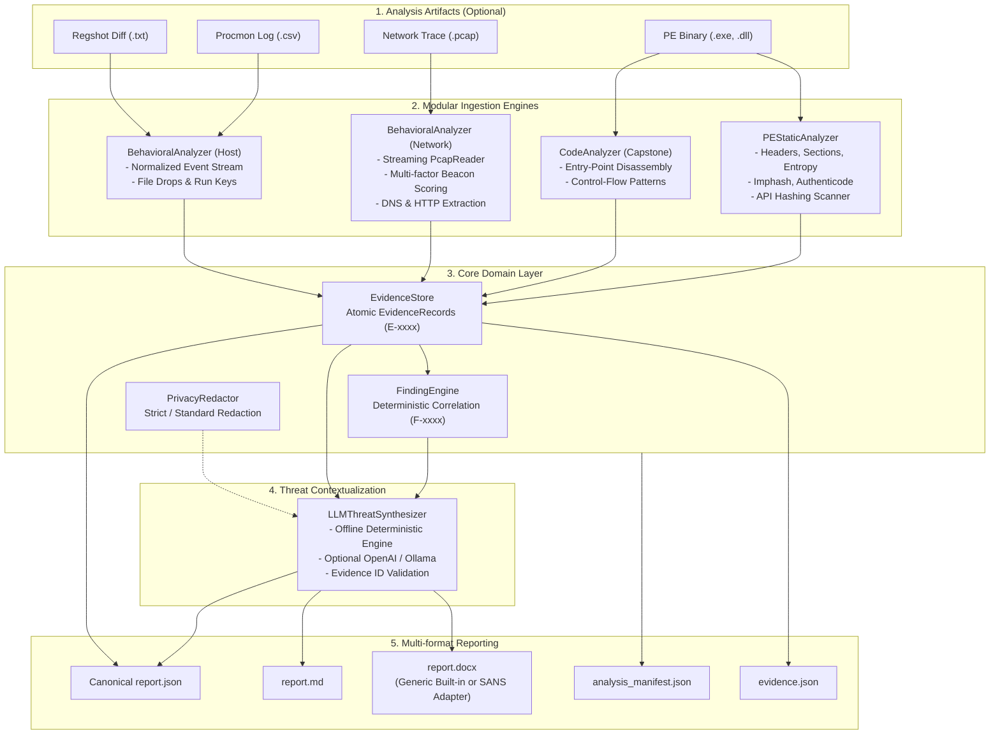

# 0206: Open, Modular Malware Triage & Evidence-Driven Reporting Platform

[](https://www.python.org/downloads/)
[](https://opensource.org/licenses/MIT)
[](https://attack.mitre.org/)
[]()

**0206** is an open, modular, evidence-grounded malware triage and automated forensic reporting platform.

Designed for reverse engineers, SOC analysts, and incident responders, 0206 bridges the gap between raw binary inspection, behavioral telemetry (PCAP network traces, Process Monitor event logs), deterministic rule correlation, and multi-format reporting (JSON, Markdown, DOCX).

---

## 🏛️ Core Architectural Philosophy

### 1. The 3-Tier Canonical Domain Model
To prevent speculative or hallucinated conclusions, 0206 strictly separates **Facts**, **Inferences**, and **Assessments**:

```
[ Tier 1: Raw Evidence (Facts) ]
       │  E-0020: "API Hash constant 0x382C0F97 (djb2: VirtualAlloc) at offset 0x8200"
       │  E-0027: "File dropped: C:\Users\<REDACTED_USER>\AppData\Local\Temp\payload.exe"
       │  E-0029: "Registry key written: HKCU\Software\Microsoft\Windows\CurrentVersion\Run"
       ▼
[ Tier 2: Technical Findings (Inferences) ]
       │  F-0001: [OBSERVED] "Embedded Win32 API Hashing Constants" (citing E-0020)
       │  F-0002: [OBSERVED] "Executable Dropped to Host Filesystem" (citing E-0027)
       │  F-0003: [OBSERVED] "Registry Autostart Persistence Modification" (citing E-0029)
       ▼
[ Tier 3: Contextual Assessment (Evaluation) ]
          A-0001: Threat Score: 65/100 (HIGH) | Classification: Backdoor / Persistent Trojan
```

### 2. Supported Evidence States
- `OBSERVED`: Explicitly verified in binary headers, sections, or event logs.
- `INFERRED`: Derived logically from observed artifacts (e.g. potential packing from high entropy + 0-sized raw section).
- `NOT_CONFIRMED`: Suspected capability whose runtime execution was not confirmed dynamically.
- `NOT_ANALYZED`: The artifact or analysis phase was not conducted.
- `NOT_AVAILABLE`: Required tool or dependency is uninstalled.

*Rule: 0206 never silently converts `NOT_ANALYZED` into a positive threat assertion.*

---

## 🧩 Architecture & Dataflow



---

## 🚀 Key Features

### 1. Capability Detection & Doctor (`0206 doctor`)
0206 provides a tiered tool adapter architecture that never crashes if third-party software is missing:

| Feature / Component | Tier | Core / Optional | External Dependency Required |
| :--- | :--- | :--- | :--- |
| **PE Static Inspection** | Tier 1 | Core | `pefile` (Python) |
| **Streaming PCAP Ingestion** | Tier 1 | Core | `scapy` (Python) |
| **Entry Disassembly** | Tier 1 | Core | `capstone` (Python) |
| **DOCX / MD / JSON Exporters** | Tier 1 | Core | `python-docx` (Python) |
| **Evidence Store & Finding Engine**| Tier 1 | Core | Pure Python / Pydantic |
| **Offline Threat Synthesizer** | Tier 1 | Core | Pure Python (Zero Internet) |
| **Ghidra Adapter** | Tier 2 | Optional | Ghidra CLI / headless |
| **YARA Rule Scanner** | Tier 2 | Optional | `yara-python` or YARA CLI |
| **radare2 Disassembler** | Tier 2 | Optional | `r2` / `radare2` |
| **capa Capability Detection** | Tier 2 | Optional | `capa` binary |
| **pe-sieve Process Dumper** | Tier 2 | Optional | `pe-sieve` binary |
| **IDA Pro Adapter** | Tier 3 | Optional | IDA Pro (`ida64` / `idat`) |
| **x64dbg / WinDbg** | Tier 3 | Optional | Windows Debugger CLI |

Run environment diagnostics at any time:
```bash
python3 main.py doctor
```

### 2. Multi-factor Composite Beacon Scoring
Rather than relying on naive packet counters, 0206 evaluates network traffic using a 5-factor weighted formula:
$$\text{Beacon Score} = 0.35 \cdot \text{Periodicity} + 0.20 \cdot \text{Consistency} + 0.25 \cdot \text{Stability} + 0.10 \cdot \text{Size Similarity} + 0.10 \cdot \text{Duration}$$

- `0.00 - 0.29`: `NORMAL`
- `0.30 - 0.59`: `SUSPICIOUS`
- `0.60 - 0.79`: `LIKELY_BEACON`
- `0.80 - 1.00`: `HIGH_CONFIDENCE_BEACON`

Connections are marked with evidence-grounded terms (`POTENTIAL_BEACON`, `SUSPECTED_C2`) and never labeled as confirmed C2 without validated protocol evidence.

### 3. Privacy-First Redaction
Built-in `PrivacyRedactor` guarantees that local usernames, home-directory paths, and hostnames are sanitized before report presentation or LLM transmission:
- `C:\Users\Alice\Documents\sample.exe` $\rightarrow$ `C:\Users\<REDACTED_USER>\Documents\sample.exe`
- `/home/bob/malware/test.bin` $\rightarrow$ `/home/<REDACTED_USER>/malware/test.bin`
- `DESKTOP-1234AB` $\rightarrow$ `<REDACTED_HOST>`
- API keys, bearer tokens, and private keys are scrubbed automatically.
- Non-mutating design: original telemetry objects are preserved.

### 4. Template Independence
- **Default:** Generates clean, standalone DOCX and Markdown reports with zero external template dependency.
- **Custom Templates:** Supports user-provided templates (including SANS-style 58-row formats) via `--template <path>`.
- Core engine contains zero proprietary course material, PDFs, or copyrighted slides.

---

## 📦 Installation

```bash
# Clone the repository
git clone https://github.com/DangGPhuc/0206.git
cd 0206

# Install dependencies in clean environment
pip install -r requirements.txt

# Run capability diagnostics
python3 main.py doctor
```

---

## 💻 Usage

### 1. Analyze Sample in Offline Mode (Safe Default)
```bash
python3 main.py analyze /path/to/sample.exe \
  --pcap /path/to/traffic.pcap \
  --procmon /path/to/procmon.csv \
  --offline \
  --output-dir output
```

### 2. Analyze with User-Provided Custom DOCX Template
```bash
python3 main.py analyze sample.exe \
  --template /path/to/custom_template.docx \
  --output-dir case_output
```

### 3. Validate a Custom DOCX Template
```bash
python3 main.py validate-template /path/to/template.docx
```

### 4. Optional AI Enrichment (OpenAI / Ollama)
```bash
# OpenAI
export OPENAI_API_KEY="sk-..."
python3 main.py analyze sample.exe --model gpt-4o

# Local Ollama (Offline Local LLM)
python3 main.py analyze sample.exe --api-base http://localhost:11434/v1 --model llama3.2
```

---

## 🛡️ Pre-commit Data & Supply-Chain Guard

To prevent accidental commits of real malware samples, PCAPs, dumps, or secrets into git, install the pre-commit hook:

```bash
ln -s ../../scripts/precommit_data_guard.py .git/hooks/pre-commit
```

Or run the guard manually:
```bash
python3 scripts/precommit_data_guard.py
```

---

## 🧪 Testing

Run the comprehensive unit and integration test suite:

```bash
python3 -m unittest discover -s tests -p "test_*.py"
```

---

## ⚠️ Limitations & Safe Usage

1. **Static and Behavioral Ingestion Only:** 0206 ingests static binaries and dynamic logs. It **does NOT** execute malware binaries directly on your host machine. Always execute malware inside an isolated virtual machine or sandbox.
2. **Packer Heuristics:** Shannon entropy and section layout differences provide indicators of packing, not definitive cryptographic proof.
3. **API Hashing:** Constants detected in binary data indicate probable dynamic resolution techniques, but runtime use must be verified dynamically.

---

## 📄 License
This platform is open source under the [MIT License](LICENSE).
