# 0206: Independent, Local-First Malware Analysis & Reporting Platform

[](https://www.python.org/downloads/)
[](https://opensource.org/licenses/MIT)
[](https://attack.mitre.org/)
[]()

> **"0206 is a local-first malware analysis and reporting platform that moves from basic triage to advanced analysis while keeping evidence, provenance, and reporting in one workflow."**

---

### In 30 Seconds: What You Need to Know

- **WHAT IS 0206?** An evidence-driven platform that triages suspicious PE binaries and behavioral telemetry, correlates static and dynamic indicators, preserves uncertainty, and compiles comprehensive reports.
- **WHY DOES IT EXIST?** Malware analysis workflows often suffer from disconnected tools, hallucinated AI summaries, ungrounded heuristics, and messy reporting. 0206 provides a rigorous pipeline connecting raw observations to verified findings.
- **WHAT DOES IT PRODUCE?** Standalone forensic case bundles containing **Machine JSON**, **Executive Markdown**, professional **DOCX reports** (generic or template-adapted), structured **Evidence Stores**, **Finding Catalogs**, **IOCs**, **Coverage Matrices**, and **Cryptographic Audit Manifests**.
- **WHAT DO I NEED TO RUN IT?** A clean machine with Python 3.10+ and standard open-source packages (`pefile`, `capstone`, `scapy`, `python-docx`, `pydantic`, `rich`). **No IDA Pro, Ghidra, x64dbg, WinDbg, PEView, cloud APIs, MCP servers, or proprietary course materials required.**

> [!IMPORTANT]
> **What 0206 IS NOT:**
> - **NOT an IDA Pro or Ghidra replacement:** 0206 performs static code triage and normalizes external disassembly/decompilation evidence.
> - **NOT a universal automated sandbox:** 0206 safely ingests recorded execution traces (PCAP, Procmon CSV, Regshot); it will **NEVER** execute live hostile malware directly on your analyst workstation.
> - **NOT an automated malware oracle:** It distinguishes potential capability from confirmed runtime behavior.
> - **NOT an official SANS institute product:** It provides independent forensic schemas compatible with industry-standard analysis workflows without distributing copyrighted courseware.

---

## ⚡ Quickstart

```bash
# 1. Clone repository
git clone https://github.com/DangGPhuc/0206.git
cd 0206

# 2. Set up virtual environment and install in editable mode
python3 -m venv .venv
source .venv/bin/activate
pip install -e .

# 3. Verify environment health & platform diagnostics
0206 doctor

# 4. Run automated offline self-test
0206 selftest

# 5. Analyze sample in 100% offline mode
0206 analyze sample.exe --offline
```

---

## 🏛️ Critical Design Principle

0206 strictly enforces non-collapsing separation across every stage of analysis:

$$\text{OBSERVATION} \longrightarrow \text{EVIDENCE} \longrightarrow \text{FINDING} \longrightarrow \text{CORRELATION} \longrightarrow \text{ASSESSMENT} \longrightarrow \text{REPORT}$$

| Stage | Example | Meaning |
| :--- | :--- | :--- |
| **Observation** | `VirtualAllocEx` imported in Import Table | Raw fact extracted from binary headers |
| **Evidence** | `E-0012` (`state=OBSERVED`, `confidence=1.0`) | Canonical, fingerprinted forensic evidence record |
| **Finding** | `F-0004` ("Possible Process Injection Capability") | Inferred capability based on static indicators |
| **Correlation** | `VirtualAllocEx` + `WriteProcessMemory` + Procmon remote thread creation | Correlating static capability with observed behavioral telemetry |
| **Assessment** | "Remote Process Injection Confirmed" (`Score: 78/100`) | Multi-domain risk evaluation and threat rating |
| **Report** | Two-stage technical report with full provenance citations | Human-readable explanation grounded in verifiable evidence IDs |

*Rule: Never treat a single weak heuristic as confirmed hostile behavior.*

---

## 📐 System Architecture

```mermaid
flowchart TD
    subgraph Inputs["1. Analysis Inputs"]
        PE["Target PE Binary (.exe, .dll)"]
        PCAP["Network Trace (.pcap)"]
        PROCMON["Procmon CSV Log (.csv)"]
        REGSHOT["Regshot Diff (.txt)"]
    end

    subgraph SecurityPolicy["2. Safety & Policy Layer"]
        RP["Resource Policy Guard (Size, Packet, Row Limits)"]
        MAN["AnalysisManifest (Pre-Analysis Streaming Hashes)"]
        REP["Reputation Engine (Hash Lookup Only - Zero Binary Upload)"]
    end

    subgraph Analyzers["3. Analysis Engines"]
        PEA["PEStaticAnalyzer (Headers, Sections, Entropy, Imports, Exports, Hashing)"]
        DIS["CodeAnalyzer (Capstone Static Code Triage & Control Flow Hints)"]
        BEH["BehavioralAnalyzer (PCAP Streaming, Beaconing Scores, Host Events)"]
        OPT["Optional Integrations (YARA, capa, Ghidra, radare2, pe-sieve)"]
    end

    subgraph EvidenceStore["4. Evidence Store & Graph"]
        ES["EvidenceStore (Atomic Deduplication, Fingerprinting, Parent-Child Lineage)"]
    end

    subgraph CorrelationEngine["5. Correlation & Findings"]
        CR["CorrelationEngine (Capability vs Observed vs Confirmed Behavior)"]
        FE["FindingEngine (Domain Weighting, Decay, & Explainable Scoring)"]
    end

    subgraph PrivacyAI["6. Privacy Boundary & Grounded AI"]
        DLP["PrivacyRedactor & DLP Filter (Scrub Usernames, Paths, Secrets)"]
        AI["Grounded AI Synthesizer (Offline Fallback | OpenAI | Anthropic | Ollama)"]
        VAL["GroundingValidator (Reject Hallucinated IOCs / Unknown Evidence IDs)"]
    end

    subgraph Deliverables["7. Case Deliverables & Lineage"]
        REP_JSON["report.json"]
        REP_MD["report.md"]
        REP_DOCX["report.docx (Generic / SANS-Style)"]
        MANIFEST["analysis_manifest.json + .sha256"]
        EV_JSON["evidence.json / findings.json / assessment.json / iocs.json / coverage.json"]
    end

    Inputs --> SecurityPolicy
    SecurityPolicy --> Analyzers
    Analyzers --> EvidenceStore
    EvidenceStore --> CorrelationEngine
    CorrelationEngine --> PrivacyAI
    PrivacyAI --> Deliverables
```



---

## 🔬 Two-Stage Analysis Structure

Every analysis report generated by 0206 follows a comprehensive two-stage structure:

### PART I — BASIC ANALYSIS
1. **Sample Identification:** File metadata, SHA256/SHA1/MD5, file size, PE architecture, subsystem, entry point RVA, image base.
2. **Reputation Assessment:** Hash reputation lookup (VirusTotal / providers). Defaults to hash lookup only; **never uploads binaries**.
3. **Basic Static Analysis:** PE sections, Shannon entropy, imports, exports, suspicious strings, URLs, IPs, API hashing constants (djb2, ror13, crc32, fnv1a).
4. **Basic Behavioral Analysis:** Ingestion and normalization of Procmon, Regshot, and telemetry logs into unified event primitives (`PROCESS_CREATE`, `FILE_WRITE`, `REGISTRY_WRITE`).
5. **Preliminary Findings:** Grounded inferences categorized by domain and confidence.
6. **Initial Triage Assessment:** Deterministic risk score and initial threat classification.

### PART II — ADVANCED ANALYSIS
7. **Advanced Static Analysis:** Loader validation, section anomalies, embedded payloads.
8. **Assembly & Code Analysis:** Entry-point disassembly via Capstone, instruction decoding, suspicious patterns.
9. **API & Control Flow Analysis:** Dynamic resolution tracking, API hashing constants, xrefs.
10. **Advanced Dynamic & Process Analysis:** Process tree hierarchies, remote thread creation, injection tracing.
11. **Memory Analysis:** RWX section identification, shellcode buffers, in-memory patch detection.
12. **Network & C2 Analysis:** Streaming PCAP processing, DNS query extraction, HTTP requests, beaconing periodicity, and jitter metrics.
13. **Persistence Analysis:** Autostart registry keys, scheduled tasks, service registrations.
14. **Anti-Analysis & Defense Evasion:** Anti-debugging, timing anomalies, virtualization checks.
15. **Unpacking & Obfuscation:** Section entropy deltas, packed headers.
16. **Cross-Stage Correlation & Final Synthesis:** Correlating static capabilities with dynamic execution traces to promote capabilities to `CONFIRMED_BEHAVIOR`.

*Note: Any domain for which evidence was not provided explicitly outputs `[NOT_ANALYZED]`. 0206 never fabricates data for missing sections.*

---

## 🔒 Privacy & DLP Security Guard

0206 incorporates a strict **Data Loss Prevention (DLP)** boundary:

$$\text{RAW DATA} \longrightarrow \text{NORMALIZED DATA} \longrightarrow \text{DLP / PRIVACY REDACTION} \longrightarrow \text{REMOTE AI}$$

- **Strict Mode (Default):** Sanitizes absolute filesystem paths, Windows usernames (`C:\Users\<USER>`), Linux users (`/home/<USER>`), hostnames, IP subnets, API keys, credentials, and private tokens before generating reports or sending data to an optional LLM.
- **DLP Transmission Gate:** If sensitive unredacted credentials or keys are detected in the payload destined for remote transmission, 0206 triggers `BLOCK_REMOTE_TRANSMISSION` and automatically falls back to offline deterministic evaluation.
- **Offline Mode:** Guarantees zero external network socket creation (`--offline`).

---

## 🤖 Grounded AI Architecture

AI in 0206 serves strictly as an **interpretation layer**, never as an evidence authority:

- **What AI CAN do:** Contextualize narrative summaries, explain relationships between findings, propose investigative hypotheses, and prioritize next reverse engineering steps.
- **What AI CANNOT do:**
  - Cannot override the deterministic threat score.
  - Cannot invent file hashes, IP addresses, domains, or registry keys.
  - Cannot claim a behavior exists without citing a verified `Evidence ID` (e.g. `E-0014`).
  - Unsupported claims are automatically **REJECTED** or **DOWNGRADED** by the `GroundingValidator`.

Supported AI Providers:
- **Offline (Default):** Deterministic, rule-based narrative synthesizer. Zero network calls, zero API keys required.
- **OpenAI:** GPT-4o / GPT-4o-mini via API key.
- **Anthropic:** Claude 3.5 Sonnet via API key.
- **Ollama:** Local open models (`llama3`, `mistral`) via local HTTP endpoints.

---

## ⚙️ Tool Adapters & Capabilities (3-Tier Model)

| Tier | Category | Tools Included | Requirements |
| :--- | :--- | :--- | :--- |
| **Tier 1 (Core)** | Built-in Core | `pefile`, `capstone`, `scapy`, `python-docx` | Installed with base package |
| **Tier 2 (Open Source)** | Optional Analyzers | `YARA`, `capa`, `Ghidra`, `radare2`, `pe-sieve`, `FLOSS` | Optional system binaries or extras |
| **Tier 3 (Proprietary)** | Optional Integrations | `IDA Pro`, `x64dbg`, `WinDbg` | User-provided external licenses |
| **Tier 4 (Agent / Protocol)** | Optional Protocol | `MCP` (Model Context Protocol) | Optional external MCP server |

*If an optional tool is missing, 0206 records `NOT_INSTALLED` or `SKIPPED` in the audit manifest and continues execution without crashing.*

---

## 📋 Analysis Profiles

Choose execution profiles tailored to the environment:

- `--profile minimal`: Core metadata and file hashes only. Ultra-fast triage.
- `--profile basic`: Minimal + static PE triage, Capstone code triage, reputation hash lookup, basic behavioral artifacts.
- `--profile standard` *(Default)*: Basic + streaming PCAP analysis, Procmon CSV normalization, Regshot diffs, YARA, capa.
- `--profile advanced`: Standard + Ghidra headless, radare2, pe-sieve, FLOSS.
- `--profile full`: All available open-source and proprietary analyzers.
- `--adaptive`: Dynamically inspects host capabilities and executes all available analyzers safely.
- `--portable`: Enforces offline mode, disables proprietary tools, and scrubs local machine paths.

---

## 💻 Complete CLI Reference

```bash
# General Syntax
0206 <subcommand> [options]

# 1. Analyze a malware sample
0206 analyze sample.exe

# 2. Analyze with behavioral telemetry artifacts
0206 analyze sample.exe --pcap network.pcap --procmon procmon.csv --regshot regshot.txt

# 3. Adaptive mode: dynamically detect environment and run available tools
0206 analyze sample.exe --adaptive

# 4. Enforce 100% offline analysis
0206 analyze sample.exe --offline

# 5. Specify execution profile
0206 analyze sample.exe --profile basic
0206 analyze sample.exe --profile advanced

# 6. Apply custom YARA rules
0206 analyze sample.exe --yara-rules /path/to/rules.yar

# 7. Use custom SANS-style DOCX report template
0206 analyze sample.exe --template /path/to/template.docx

# 8. Run system doctor and tool diagnostics
0206 doctor

# 9. Run automated offline self-test suite
0206 selftest

# 10. Validate a custom DOCX report template
0206 validate-template template.docx

# 11. Inspect an audit manifest
0206 manifest output/analysis_manifest.json
```

---

## 📦 Output Case Structure

Each analysis session creates a self-contained case directory:

```
output/
├── analysis_manifest.json     # Complete execution environment, timings, tool versions, and output hashes
├── analysis_manifest.sha256   # Detached cryptographic hash of the manifest
├── evidence.json              # Canonical list of all fingerprinted EvidenceRecords
├── findings.json              # Derived technical findings and confidence scores
├── assessment.json            # Deterministic threat score, classification, and score breakdown
├── iocs.json                  # Extracted host and network indicators of compromise
├── coverage.json              # Analysis coverage across all 25 analysis domains
├── report.json                # Complete machine-readable session deliverable
├── report.md                  # Two-stage executive and technical Markdown report
├── report.docx                # Professional Word document (generic or template-adapted)
├── artifacts/                 # Collected intermediate telemetry files
└── figures/                   # Visual diagrams and entropy plots
```

---

## 🛡️ Honest Limitations

0206 maintains complete transparency regarding capabilities:

1. **Static Disassembly Limits:** Capstone static triage disassembles starting at the PE entry point. It does not replace manual interactive reverse engineering in IDA or Ghidra for heavily obfuscated control flow, opaque predicates, or packed binaries.
2. **Dynamic Execution Safety:** 0206 will **never** execute hostile binaries directly on the host machine. Dynamic analysis is performed by ingesting recorded telemetry artifacts (PCAP, Procmon) or executing within an external isolated VM/sandbox.
3. **Reputation Lookup Boundaries:** Reputation queries are strictly **hash-based**. 0206 will never upload suspicious binary contents to third-party reputation APIs.
4. **Offline Heuristics:** In offline mode, narrative summaries are deterministically compiled from correlated findings without invoking remote AI models.

---

## 📄 License

0206 is licensed under the [MIT License](LICENSE).
